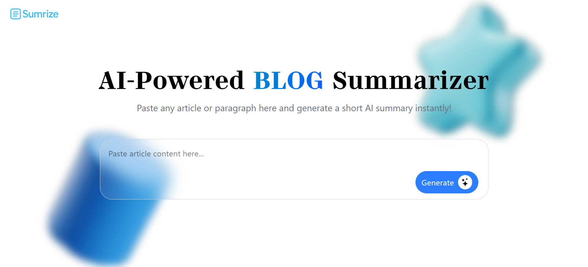

# Sumrize AI 🧠✨

  

## 🚀 Features

- ✍️ Paste any blog/article text
- ⚡ One-click AI summarization
- 🧠 Powered by Hugging Face transformers
- 💅 Responsive & elegant UI (React + TailwindCSS)
- 🧾 TypeScript based frontend and backend

## 🛠️ Tech Stack

- **Frontend**: React, TypeScript, Tailwind CSS
- **Backend**: Node.js, Express, TypeScript
- **AI Model**: HuggingFace `tuner007/pegasus_summarizer`

```bash
git clone https://github.com/pavan-rajulapati/blog-summarizer.git
cd blog-summarizer
```
